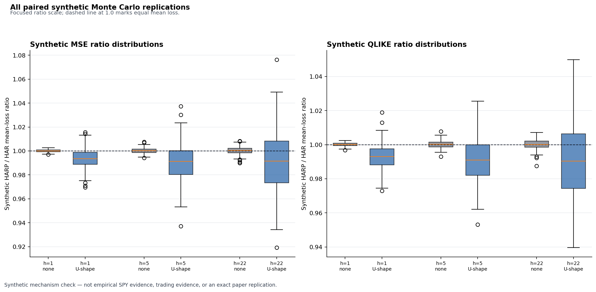

# HARP Realized-Volatility Forecasting

> **Public synthetic mechanism study. No third-party market data or provider-derived outputs are included.**

A partial methodological replication and extension of periodicity-aware realized-volatility forecasting, validated with a fully synthetic paired Monte Carlo study.

The project asks whether filtering a stable intraday volatility pattern from HAR predictors can improve forecasts of unfiltered future realized variance. Adam Polanský implemented the HAR/HARP pipeline, causal periodicity vintages, leakage-safe rolling evaluation, paired simulation, diagnostics, and reproducibility controls in Python.

## 30-second overview

- Implements realized variance, bipower variation, a causal weighted-standard-deviation (WSD) intraday periodicity estimator, and direct HAR/HARP forecasts at 1-, 5-, and 22-day horizons.
- Re-fits each model daily on exactly 1,000 fully observed training targets and tests the information embargo `s + h <= t`.
- Evaluates paired forecasts with MSE, QLIKE, and a pre-specified Diebold–Mariano test.
- Ships the frozen configuration, child seeds, replication-level results, summary table, figures, and integrity tests.
- Contains only provider-agnostic code and synthetic evidence. It contains no market data or restricted-data-derived result.

| Frozen design | No periodicity | U-shaped periodicity |
|---|---:|---:|
| Median HARP/HAR loss-ratio range | 1.00003–1.00036 | 0.9903–0.9934 |
| Paired replications per scenario | 200 | 200 |
| Common OOS origins per replication | 500 | 500 |
| Horizons | 1 / 5 / 22 days | 1 / 5 / 22 days |
| Losses | MSE, QLIKE | MSE, QLIKE |

**Headline synthetic result.** Without intraday periodicity, HAR and HARP produce loss ratios centered near parity. Under a fixed U-shaped periodicity design, HARP achieves small median loss reductions across all evaluated horizons and losses, although gains are not universal across replications. In the U-shaped cells, **64.0% to 80.5%** of ratios are below one; in the control cells, **45.0% to 49.5%** are below one.



Parity is one. The vertical axis is intentionally a **focused ratio scale**, and each box shows the cross-replication distribution—not uncertainty for a population median. The overlap with parity makes the limited, non-universal nature of the synthetic gains visible.

## Why this matters

Intraday seasonality can contaminate lagged realized-volatility predictors even when the forecast target itself should remain economically interpretable. This lab makes the timing contract explicit: estimate the periodicity factor from the past, freeze each historical vintage, filter only HARP predictors, and give HAR and HARP identical targets, origins, and innovations. The paired design isolates implementation behavior without requiring restricted data.

## Reproduce a bounded smoke run

From the repository root, using Python 3.12:

```bash
python -m venv .venv
# POSIX: source .venv/bin/activate
# Windows PowerShell: .venv\Scripts\Activate.ps1
python -m pip install --upgrade pip
python -m pip install -e ".[dev]"
python scripts/run_monte_carlo.py --root reproductions/smoke --workers 1 --smoke
python -m pytest
ruff check .
ruff format --check .
```

The smoke run is deliberately small and writes only ignored local output. The frozen 200-replication study is not run in CI; the exact full-run command and artifact hashes are in [Reproducibility](docs/reproducibility.md).

## Method

- **HAR:** direct horizon-specific regression on daily, weekly, and monthly unfiltered realized-variance predictors.
- **HARP:** the same direct target and rolling protocol, but with causal WSD-periodicity-filtered right-hand-side predictors.
- **Past-only filtering:** the factor applied on day `t` uses only `[t-1008, t-1]`, and earlier filtered values are never revised.
- **Daily refit:** each model is re-estimated at every forecast origin using exactly 1,000 fully known rows.
- **Leakage embargo:** a row `s` is eligible at origin `t` only when its full direct target is known, `s + h <= t`.
- **Evaluation:** horizons 1/5/22, MSE, QLIKE, and a two-sided DM test with pre-specified HAC bandwidth and HLN small-sample correction.

The target always remains unfiltered realized variance. The causal **1,008-day WSD window is a pre-specified project extension**; the final article's main specification uses a 20-day window. This difference is one reason the project is not an exact replication.

## Frozen Monte Carlo design

The study uses two artificial mechanisms, 78 five-minute intraday slots, 500 burn-in days, 3,000 usable days, 200 paired replications per scenario, 500 common forecast origins, and horizons 1/5/22. HARP and HAR share the same latent and intraday innovations within every scenario pair. Child seeds descend deterministically from master seed `20250107342`.

At each origin, HAR uses unfiltered realized-variance lags; HARP uses immutable, vintage-specific periodicity-filtered lags. Both forecast the same unfiltered future realized variance. The causal WSD estimate for day `t` uses only days `[t-1008, t-1]`. See the [method protocol](docs/method_protocol_v0_2.md) for formulas and indexing.

The reported 2.5th–97.5th percentiles are a **central 95% cross-replication interval** of replication-specific loss ratios. They are not a confidence interval for the median. Directional DM rejection frequencies are descriptive mechanism-study diagnostics, not a standalone size or power study.

## Evidence and audit trail

- [Results](docs/results.md) — all 12 scenario × horizon × loss cells, including DM rejection rates and QLIKE diagnostics.
- [Reproducibility](docs/reproducibility.md) — environment, commands, seed hierarchy, and checksums.
- [Validation](docs/validation.md) — causal-vintage, shared-innovation, formula, refit, leakage, and frozen-artifact tests.
- [Paper/version crosswalk](docs/paper_version_crosswalk.md) — implementation choices and deliberate differences.
- [Public claims and non-claims](docs/public_claims_and_nonclaims.md) — publication boundary.

## Project structure

```text
src/                    HAR/HARP, WSD, metrics, aggregation, and validation code
scripts/                deterministic Monte Carlo runner
config/                 frozen full-study configuration
tests/                  formula, causality, leakage, and integrity tests
results/synthetic/      replication-level and summary CSV evidence
figures/synthetic/      public synthetic figures
artifacts/synthetic/    child seeds, chart map, and run receipt
docs/                   method, results, validation, and reproduction notes
```

## Scope and limitations

This project is a partial methodological replication and extension inspired by Dumitru et al., *Journal of Banking & Finance* 170 (2025), article 107342 ([DOI 10.1016/j.jbankfin.2024.107342](https://doi.org/10.1016/j.jbankfin.2024.107342)). It is **not an exact paper replication**:

- the causal 1,008-day WSD window is a pre-specified project extension, not the final article's main 20-day window;
- the two-scenario synthetic data-generating process is not the paper's Monte Carlo design;
- the HAC bandwidth, HLN correction, QLIKE floor, and rolling-window details are explicit project pre-specifications;
- the repository makes no empirical, trading, alpha, or profitability claim.

The paper constructs five-minute returns from tick data using previous-tick interpolation. This project's general local interface instead validates aggregated intraday bars; it does not claim tick, quote, or order-book fidelity. The synthetic study does not demonstrate empirical SPY performance, causal effects, return-direction prediction, production readiness, or future performance. It is neither a trading strategy nor a state-of-the-art machine-learning claim.

## Data policy

No third-party market data, credential, provider integration, or provider-derived output is distributed. Users may supply independently licensed data through the validation-only adapter, but acquisition, interpolation, and empirical conclusions are outside this release. Raw and empirical paths are ignored by Git.

## Citation and license

Please cite the software using [CITATION.cff](CITATION.cff). Released under the [MIT License](LICENSE).
