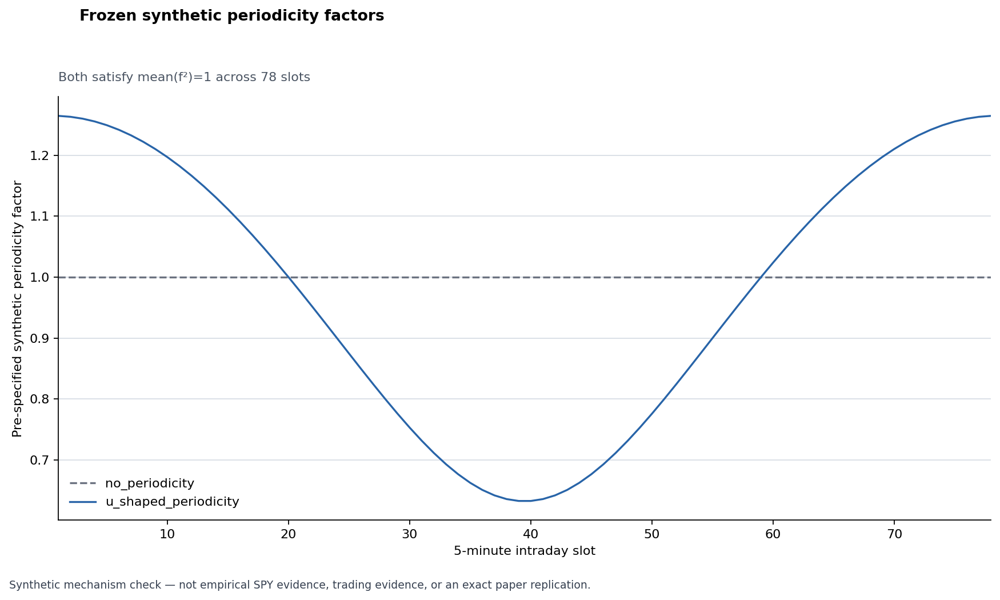

# Synthetic Monte Carlo results

## Answer first

The frozen synthetic study behaves as the mechanism predicts. When a U-shaped intraday periodicity factor is present, HARP's median mean-loss ratio relative to HAR is below one in every horizon/loss cell. When periodicity is absent, the median ratios are effectively one. This is evidence about the implementation under two artificial mechanisms only; it is not empirical market or trading evidence.

`HARP/HAR < 1` means lower mean loss for HARP. Each row contains 200 valid paired replications evaluated on the same 500 origins. The 2.5th and 97.5th percentiles form a **central 95% cross-replication interval** of replication-specific loss ratios. They are not a confidence interval for the median.

| Scenario | h | Loss | Valid reps | Median ratio | Central 95% cross-replication interval | Share < 1 | DM reject HARP | DM reject HAR | QLIKE floors HAR/HARP |
|---|---:|---|---:|---:|---:|---:|---:|---:|---:|
| No periodicity | 1 | MSE | 200 | 1.00005 | [0.99778, 1.00221] | 48.0% | 3.5% | 2.5% | — |
| No periodicity | 1 | QLIKE | 200 | 1.00003 | [0.99815, 1.00205] | 49.5% | 3.0% | 2.5% | 0 / 0 |
| No periodicity | 5 | MSE | 200 | 1.00012 | [0.99601, 1.00422] | 46.0% | 2.5% | 8.0% | — |
| No periodicity | 5 | QLIKE | 200 | 1.00025 | [0.99653, 1.00381] | 46.5% | 3.0% | 6.0% | 0 / 0 |
| No periodicity | 22 | MSE | 200 | 1.00036 | [0.99337, 1.00709] | 45.0% | 4.0% | 3.5% | — |
| No periodicity | 22 | QLIKE | 200 | 1.00015 | [0.99416, 1.00577] | 47.0% | 5.0% | 3.5% | 0 / 0 |
| U-shaped periodicity | 1 | MSE | 200 | 0.99343 | [0.97537, 1.00879] | 80.0% | 10.5% | 0.5% | — |
| U-shaped periodicity | 1 | QLIKE | 200 | 0.99310 | [0.97853, 1.00561] | 80.5% | 15.0% | 0.5% | 0 / 0 |
| U-shaped periodicity | 5 | MSE | 200 | 0.99139 | [0.96227, 1.02280] | 73.5% | 12.0% | 1.5% | — |
| U-shaped periodicity | 5 | QLIKE | 200 | 0.99095 | [0.96588, 1.01872] | 75.5% | 14.5% | 1.0% | 0 / 0 |
| U-shaped periodicity | 22 | MSE | 200 | 0.99156 | [0.95143, 1.04063] | 64.0% | 10.0% | 1.5% | — |
| U-shaped periodicity | 22 | QLIKE | 200 | 0.99031 | [0.95408, 1.03764] | 66.5% | 12.0% | 1.0% | 0 / 0 |

DM rejection rates split significant two-sided 5% tests by the sign of the mean loss differential `L_HARP - L_HAR`: “HARP” is a significant negative differential and “HAR” a significant positive differential. Total rejection frequency in the no-periodicity cells is 5.5%–10.5%; this is not a standalone calibration, size, or power study of the DM test. U-shaped HARP-direction rejection rates of 10.0%–15.0% show limited detection frequency, not universal superiority. These are descriptive frequencies across 200 artificial replications, not effect sizes.

All 12 cells have 200/200 valid replications. Both HAR and HARP record zero QLIKE floor interventions, so the numerically valid QLIKE share is 100% in every QLIKE cell.

The narrow vertical range in the second figure is deliberately a **focused ratio scale**. The dashed line at one marks equal mean loss.
